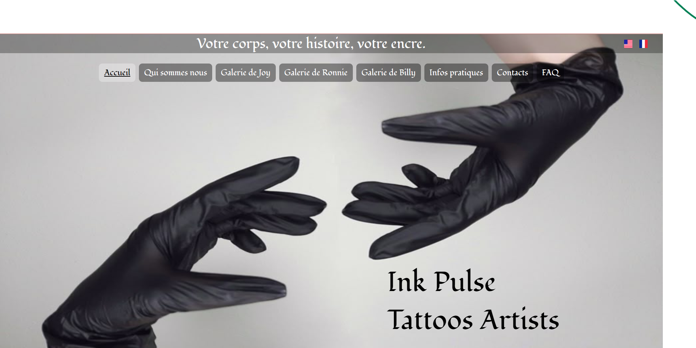
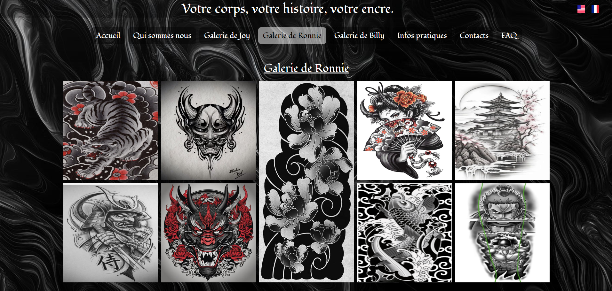
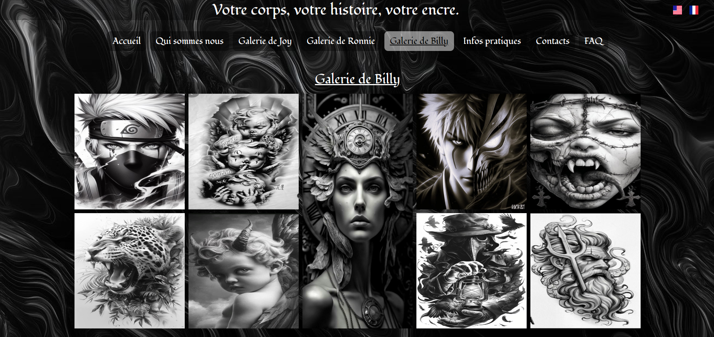
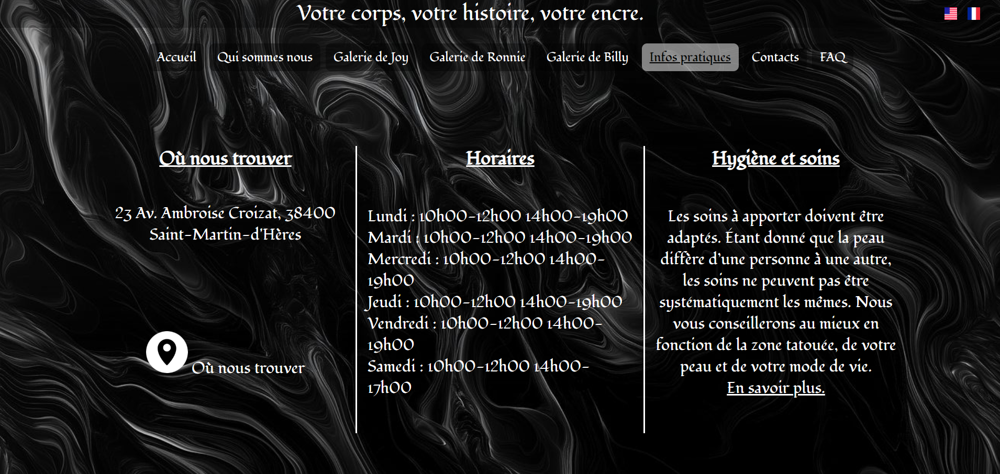
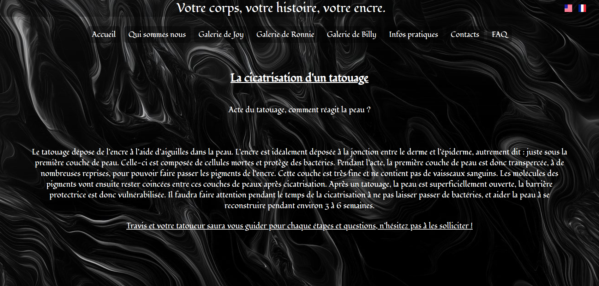
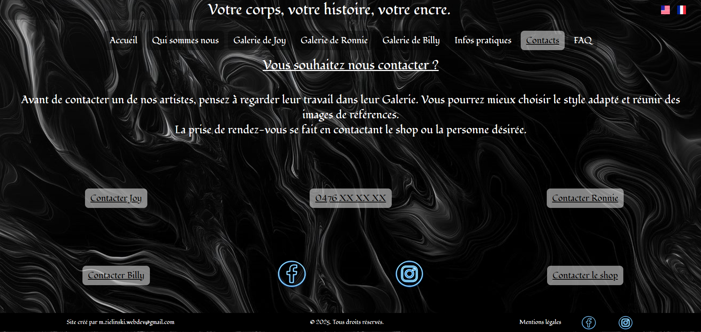
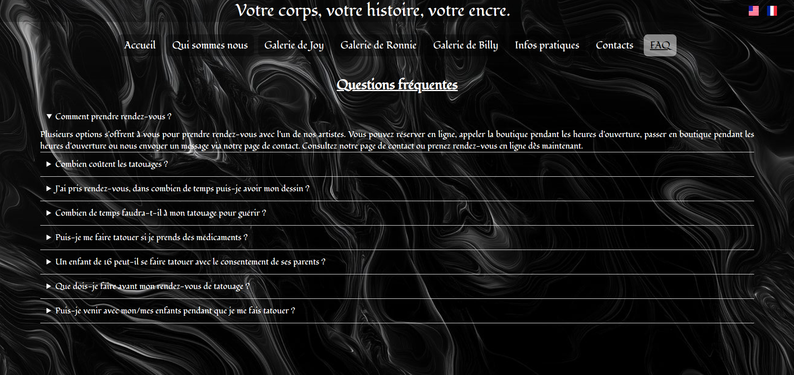
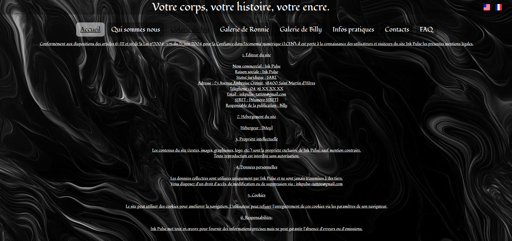

# 🖤 Ink Pulse by Marine Mey Zielinski — Site Vitrine de Tatouage

Bienvenue dans mon premier projet : le dépôt du site vitrine Ink Pulse by, une vitrine en ligne dédiée à l'art du tatouage. Ce site a pour objectif de présenter mon univers, des créations, des inspirations.

## 🎨 À propos

Ink Pulse by Marine Mey Zielinski est bien plus qu’un simple site : c’est une immersion dans un univers artistique. Vous y trouverez :
- Trois galeries de réalisations
- Une présentation de différents styles et parcours.
- Différentes options pour prendre contact avec l'équipe.
- Les réseaux sociaux du shop.

## 🛠️ Technologies utilisées

Ce site a été développé avec :

- **HTML5** / **CSS3**
- Responsive design (optimisé pour mobile et desktop)

## 📸 Aperçu













## 📂 Installation locale

Pour visualiser le site en local :

```bash
git clone https://github.com/MarineMeyZielinski/InkPulse-code.git
cd InkPulse-code
ouvrir index.html dans votre navigateur
